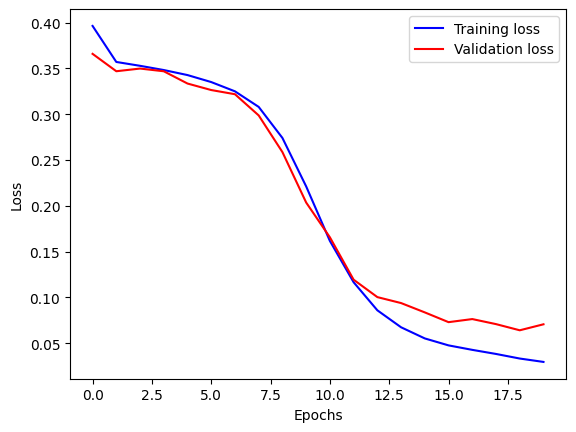

## 1. Data Preprocessing

### Cleaning Text
The `clean_text` function preprocesses text data by:
- Removing specified characters and symbols.
- Eliminating single-letter words.
- Lowercasing text and removing extra spaces.
- Lemmatizing words and removing stopwords.

```python
def clean_text(text):
    # Implementation details as described above
    return text
```

### Removing Specific Words
The `remove_specific_words` function removes manually identified irrelevant words from text.

```python
def remove_specific_words(text):
    # Implementation details as described above
    return text
```

## 2. Tokenization and Encoding

### Tokenization
Using `tf.keras.preprocessing.text.Tokenizer`, text is converted into numerical sequences with a vocabulary limited to 20,000 words, replacing out-of-vocabulary words with "out_of_vocab".

```python
tokenizer = tf.keras.preprocessing.text.Tokenizer(num_words=20000, oov_token="out_of_vocab")
tokenizer.fit_on_texts(df['v2_clean'])
df["v2_encoded"] = tokenizer.texts_to_sequences(df['v2_clean'])
```

### Padding Sequences
Sequences are padded to a fixed length using `tf.keras.preprocessing.sequence.pad_sequences` to facilitate model training.

```python
X = tf.keras.preprocessing.sequence.pad_sequences(df['v2_encoded'], padding="post")
```

## 3. Model Building

### Model Architecture
A sequential model for text classification:

```python
model = tf.keras.Sequential([
    tf.keras.layers.Embedding(num_words + 1, 16, input_shape=[input_shape,], name="embedding"),
    tf.keras.layers.GlobalAveragePooling1D(),
    tf.keras.layers.Dense(16, activation='relu'),
    tf.keras.layers.Dense(1, activation="sigmoid")
])
```

### Compilation and Training
Configuring the model with Adam optimizer, Binary Crossentropy loss, and accuracy, precision, and recall metrics.

```python
optimizer = tf.keras.optimizers.Adam()
model.compile(optimizer=optimizer,
              loss=tf.keras.losses.BinaryCrossentropy(),
              metrics=['accuracy', tf.keras.metrics.Precision(), tf.keras.metrics.Recall()])
```

## 4. Results

